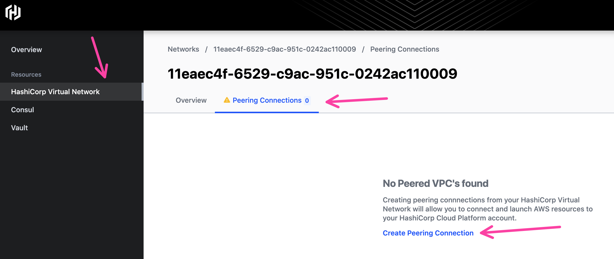
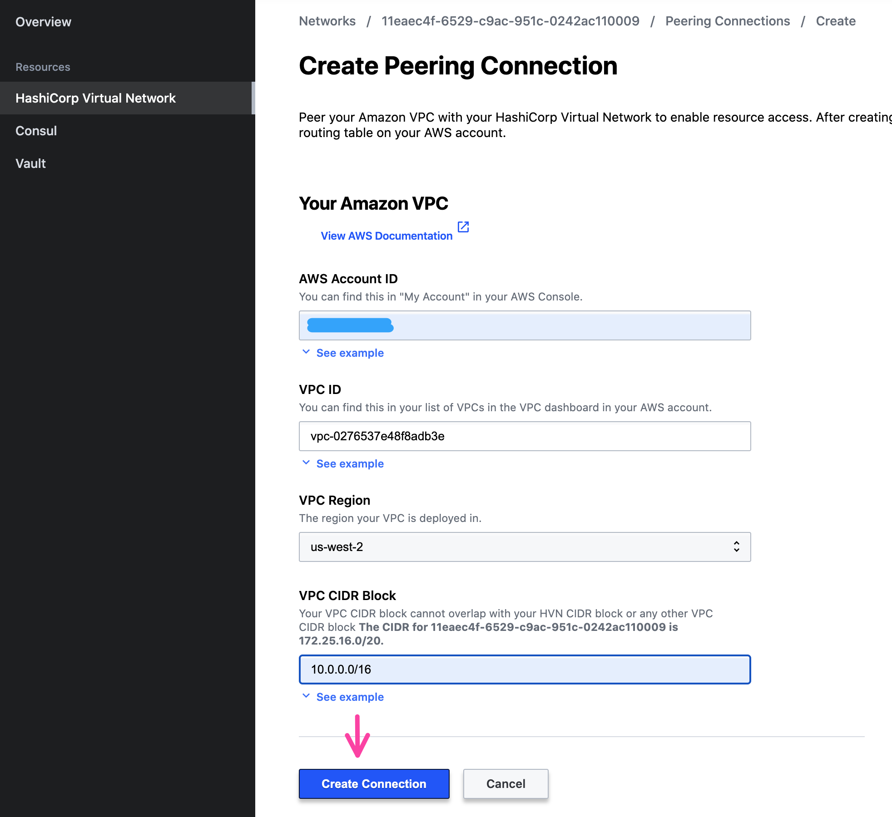
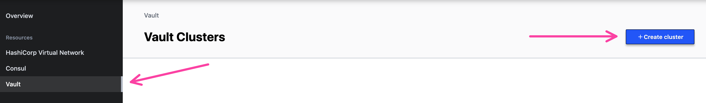
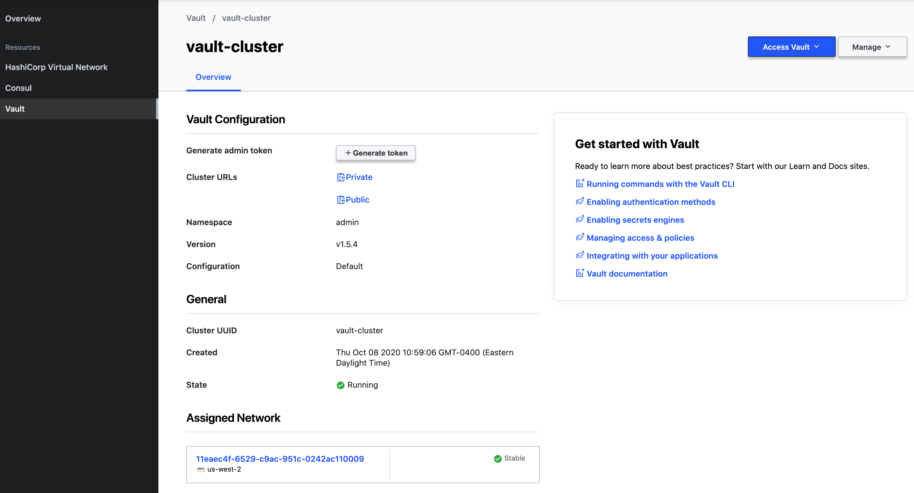
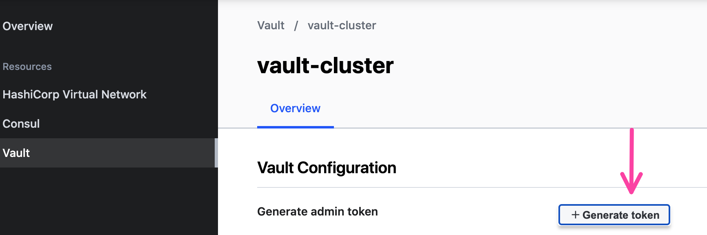
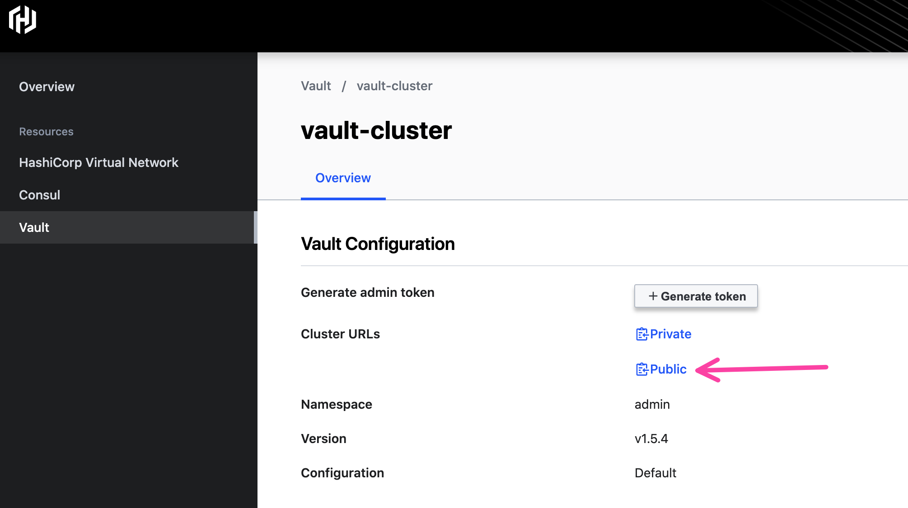
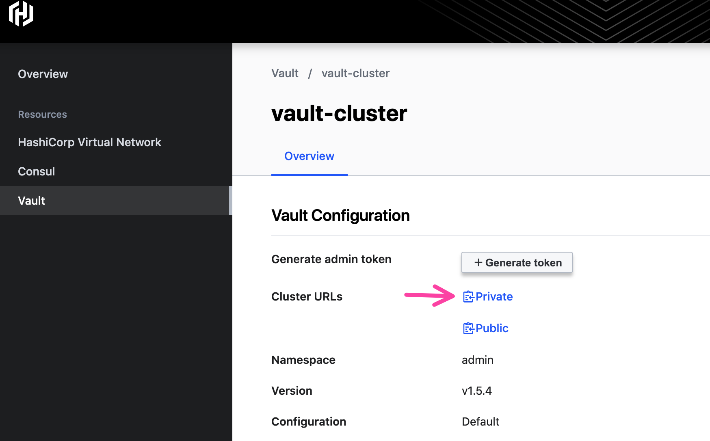

# HCP Vault with AWS EKS

## Prerequisites

- HashiCorp Virtual Network
- EKS Cluster and VPC in AWS, region should be `us-west-2`. If you need an example configuration,
  check out the Terraform in [this repository](./eks).
- Set your local KUBECONFIG to the EKS cluster.
  ```shell
  export AWS_REGION=us-west-2
  aws eks update-kubeconfig --name ${EKS_CLUSTER_NAME}
  ```
- Security Group for your EKS cluster that allows inbound connections from the Vault CIDR Block

## Add the Peering Connection

Go to Resources -> HashiCorp Virtual Network. Go to the
"Peering Connection" tab and click "Create Peering Connection".



Add your AWS Account ID, VPC ID hosted the ECS cluster, region,
and VPC CIDR block. Select "Create Connection".



You will need to go into the AWS Console and accept the peering
connection for HVN.

## Create an HCP Vault Cluster

Go to the Vault sidebar. Select "Create Cluster" to build
a new HCP Vault cluster.



Keep the name of the cluster as `vault-cluster`.
Check that your HVN is populated and click "Create cluster".


The cluster will take some time to create but HCP will update the
loading screen when it is ready.



## Authenticate to Vault

Click "Generate Token".



Copy the administrator token and set it in your terminal
to an environment variable `VAULT_TOKEN`.

```shell
$ export VAULT_TOKEN=s.*******************
```

Click the clipboard next to "Public". This will copy the public Vault
address to your clipboard.



Copy and paste the Vault address and set it as `VAULT_ADDR` and namespace as `VAULT_NAMESPACE`
into your command line.

```shell
$ export VAULT_ADDR=https://vault-cluster.vault.**************.aws.hashicorp.cloud:8200
$ export VAULT_NAMESPACE=admin
```

Click the clipboard next to "Private". This will copy the private Vault
address to your clipboard.



Copy and paste the Vault __private__ address into your command line as the `VAULT_PRIVATE_ADDR`
environment variable. You can use the private address because the EKS cluster will use it to
access HCP Vault over HVN.

```shell
$ export VAULT_PRIVATE_ADDR=https://vault-cluster.private.vault.**************.aws.hashicorp.cloud:8200
```

## Enable Auth Methods amd Secrets Engines

In your terminal, enable the Kubernetes Auth Method.

```shell
$ vault auth enable kubernetes                                                                                                            
Success! Enabled kubernetes auth method at: kubernetes/
```

Then, enable the PostgreSQL Secrets engine.

```shell
$ vault secrets enable database
Success! Enabled the database secrets engine at: database/
```

## Deploy Vault Agents to EKS

Retrieve the Helm chart from the HashiCorp Helm repository.

```shell
$ helm repo add hashicorp https://helm.releases.hashicorp.com
"hashicorp" has been added to your repositories
```

Create a `values.yaml` file that sets the external servers to HCP Consul.

```shell
$ echo 'injector:
  enabled: true
  externalVaultAddr: "'${VAULT_PRIVATE_ADDR}'"
  agentImage:
    tag: "1.5.4"' > values.yml
```

Deploy the Vault Helm chart with the Vault agent

```shell
$ helm install vault hashicorp/vault -f values.yml
```

Check that the Vault agent injector runs.

```shell
$ kubectl get pods
NAME                                   READY   STATUS    RESTARTS   AGE
vault-agent-injector-c8fd9fc5f-jhhw9   1/1     Running   0          2m11s
```

Now, configure a Kubernetes service account for the Kubernetes Auth Method.

```shell
$ kubectl apply -f kubernetes/vaultauth.yml
serviceaccount/vault-auth created
secret/vault-auth created
clusterrolebinding.rbac.authorization.k8s.io/role-tokenreview-binding created
```

Get the JWT for the service account, Kubernetes CA certificate, and the Kubernetes
host URL.

```shell
$ TOKEN_REVIEW_JWT=$(kubectl get secret vault-auth -o go-template='{{ .data.token }}' | base64 --decode)
$ KUBE_CA_CERT=$(kubectl config view --raw --minify --flatten -o jsonpath='{.clusters[].cluster.certificate-authority-data}' | base64 --decode)
$ KUBE_HOST=$(kubectl config view --raw --minify --flatten -o jsonpath='{.clusters[].cluster.server}')
```

Configure the Vault Kubernetes auth method to use the service account token.

```shell
$ vault write auth/kubernetes/config \
        token_reviewer_jwt="$TOKEN_REVIEW_JWT" \
        kubernetes_host="$KUBE_HOST" \
        kubernetes_ca_cert="$KUBE_CA_CERT"
Success! Data written to: auth/kubernetes/config
```

## Deploy a Database

```shell
$ kubectl apply -f kubernetes/postgres.yml
service/postgres created
deployment.apps/postgres created

$ kubectl get pods
NAME                                   READY   STATUS    RESTARTS   AGE
postgres-5bbfc8bb5c-9px77              1/1     Running   0          31s
vault-agent-injector-c8fd9fc5f-jhhw9   1/1     Running   0          2m34s
```

## Add the Database role to Vault

Create the database configuration that allows Vault to connect to Postgres.

```shell
$ POSTGRES_PORT=$(kubectl get -o jsonpath="{.spec.ports[0].nodePort}" services postgres)

$ POSTGRES_IP=$(kubectl get pods --selector app=postgres -o jsonpath='{.items[*].status.hostIP}')

$ vault write database/config/nyc \
    plugin_name=postgresql-database-plugin \
    allowed_roles="*" \
    connection_url="postgresql://{{username}}:{{password}}@${POSTGRES_IP}:${POSTGRES_PORT}/nyc?sslmode=disable" \
    username="postgres" \
    password="password"
```

You know you can successfully access the Vault cluster if you can log in with the PostgreSQL password you
sent to Vault.

```shell
$ kubectl exec -it $(kubectl get pods --selector "app=postgres" -o jsonpath="{.items[0].metadata.name}") \
   -c postgres -- bash -c 'PGPASSWORD=password psql -U postgres'

psql (11.6 (Debian 11.6-1.pgdg90+1))
Type "help" for help.

postgres-# \l
                                 List of databases
   Name    |  Owner   | Encoding |  Collate   |   Ctype    |   Access privileges   
-----------+----------+----------+------------+------------+-----------------------
 nyc       | postgres | UTF8     | en_US.utf8 | en_US.utf8 | 
 postgres  | postgres | UTF8     | en_US.utf8 | en_US.utf8 | 
 template0 | postgres | UTF8     | en_US.utf8 | en_US.utf8 | =c/postgres          +
           |          |          |            |            | postgres=CTc/postgres
 template1 | postgres | UTF8     | en_US.utf8 | en_US.utf8 | =c/postgres          +
           |          |          |            |            | postgres=CTc/postgres
(4 rows)

postgres-# \q
```

In your terminal, create a database role that allows Vault to issue database passwords.

```shell
$ vault write database/roles/nyc \
    db_name=nyc \
    creation_statements="CREATE ROLE \"{{name}}\" WITH LOGIN PASSWORD '{{password}}' VALID UNTIL '{{expiration}}'; \
        GRANT SELECT ON ALL TABLES IN SCHEMA public TO \"{{name}}\";" \
    revocation_statements="ALTER ROLE \"{{name}}\" NOLOGIN;"\
    default_ttl="1h" \
    max_ttl="24h"
```

Using this role, can actually get a new set of credentials from Vault for the PostgreSQL database!

```shell
$ vault read database/creds/nyc
Key                Value
---                -----
lease_id           database/creds/nyc/V0oSoqQyHQraGAnW0O7jEz0Z.9NK0g
lease_duration     1h
lease_renewable    true
password           REDACTED
username           v-token-hc-db-app-ZamODsbHMPfejm0j2of1-1602182547
```

## [WIP] Get the service to authenticate to Vault

```shell
$ cat <<EOF > web.hcl
path "database/creds/web" {
  capabilities = ["read"]
}
EOF
```

```shell
$ vault policy write web ./web.hcl
Success! Uploaded policy: web
```

Bind the service account to the web application.

```shell
$ vault write auth/kubernetes/role/web \
    bound_service_account_names=web \
    bound_service_account_namespaces=default \
    policies=web \
    ttl=1h
```

Deploy the web service. Make sure that you include your HCP
Vault namespce in your Kubernetes manifest!

```shell
$ grep ${VAULT_NAMESPACE} kubernetes/web.yml
        vault.hashicorp.com/namespace: "admin"

$ kubectl apply -f kubernetes/web.yml 
service/web-service created
serviceaccount/web created
deployment.apps/web-deployment created
```

The web deployments should initialize with postgres enabled.

```shell

```

## Clean Up

```shell

```