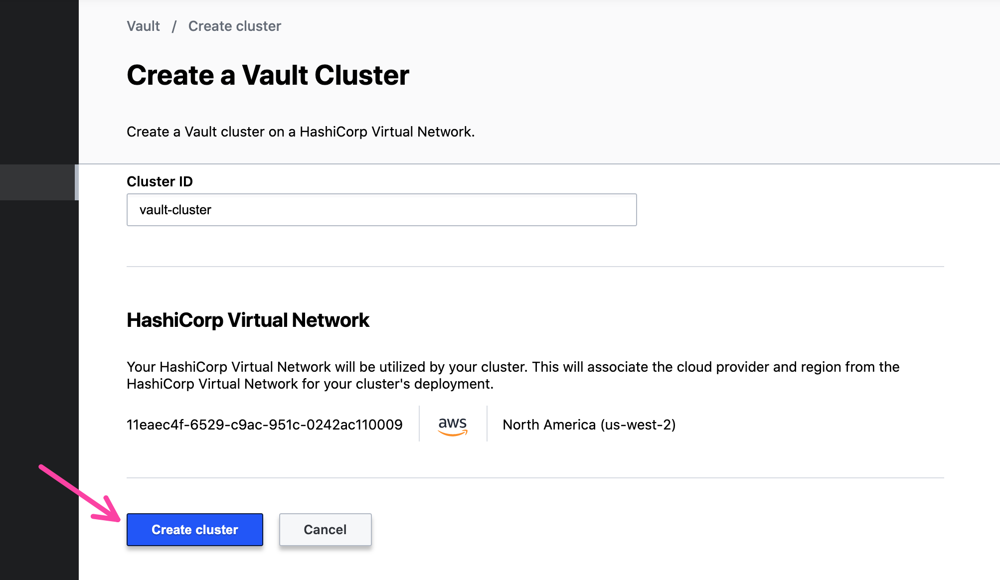

# HashiCorp Cloud Platform Vault with AWS Elastic Kubernetes Service

## Prerequisites

- HashiCorp Virtual Network (HVN)
- EKS Cluster and VPC in AWS, region should be `us-west-2`. If you need an example configuration,
  check out the Terraform in [this repository](./eks).
- Set your local KUBECONFIG to the EKS cluster.
  ```shell
  export AWS_REGION=us-west-2
  aws eks update-kubeconfig --name ${EKS_CLUSTER_NAME}
  ```
- Security Group for your EKS cluster that allows inbound connections from the Vault CIDR Block.
  We use the `NodePort` configuration for Kubernetes services to allow Vault to connect to Kubernetes
  without a load balancer.

## Add the Peering Connection from EKS to HVN

Go to Resources -> HashiCorp Virtual Network. Go to the
"Peering Connection" tab and click "Create Peering Connection".


Add your AWS Account ID, VPC ID hosted the ECS cluster, region,
and VPC CIDR block. Select "Create Connection".


You will need to go into the AWS Console and accept the peering
connection for HVN.

## Create an HCP Vault Cluster

Go to the Vault sidebar. Select "Create Cluster" to build
a new HCP Vault cluster.


Keep the name of the cluster as `vault-cluster`.
Check that your HVN is populated and click "Create cluster".



The cluster will take some time to create but HCP will update the
loading screen when it is ready.


## Authenticate to Vault

Click "Generate Token".


Copy the administrator token and set it in your terminal
to an environment variable `VAULT_TOKEN`.

```shell
$ VAULT_TOKEN=s.*******************
```

Click the clipboard next to "Public". This will copy the public Vault
address to your clipboard.


Copy and paste the Vault address and set it as `VAULT_ADDR` and namespace as `VAULT_NAMESPACE`
into your command line.

```shell
$ VAULT_ADDR=https://vault-cluster.vault.**************.aws.hashicorp.cloud:8200
$ VAULT_NAMESPACE=admin
```

Click the clipboard next to "Private". This will copy the private Vault
address to your clipboard.


Copy and paste the Vault __private__ address into your command line as the `VAULT_PRIVATE_ADDR`
environment variable. You can use the private address because the EKS cluster will use it to
access HCP Vault over HVN.

```shell
$ VAULT_PRIVATE_ADDR=https://vault-cluster.private.vault.**************.aws.hashicorp.cloud:8200
```

## Enable Auth Methods amd Secrets Engines

In your terminal, enable the Kubernetes Auth Method. This will allow
services on Kubernetes to authenticate to Vault for secrets.

```shell
$ vault auth enable kubernetes                                                                                                            
Success! Enabled kubernetes auth method at: kubernetes/
```

Then, enable the PostgreSQL Secrets engine. This facilitates the rotation
and management of database usernames and passwords.

```shell
$ vault secrets enable database
Success! Enabled the database secrets engine at: database/
```

## Deploy Vault Agents to EKS

Retrieve the Helm chart from the HashiCorp Helm repository.

```shell
$ helm repo add hashicorp https://helm.releases.hashicorp.com
"hashicorp" has been added to your repositories
```

Create a `values.yaml` file that sets the external servers to HCP Consul.
This will deploy a Vault agent injector into the cluster without a full Vault
server setup.

```shell
$ echo 'injector:
  enabled: true
  externalVaultAddr: "'${VAULT_PRIVATE_ADDR}'"
  agentImage:
    tag: "1.5.4"' > values.yml
```

Deploy the Vault Helm chart with the Vault agent.

```shell
$ helm install vault hashicorp/vault -f values.yml
```

Check that the Vault agent injector runs.

```shell
$ kubectl get pods
NAME                                   READY   STATUS    RESTARTS   AGE
vault-agent-injector-c8fd9fc5f-jhhw9   1/1     Running   0          2m11s
```

Now, configure a Kubernetes service account for the Kubernetes Auth Method.
Since you do not deploy servers, you need to get a JSON Web Token from Kubernetes
to allow Vault access.

```shell
$ kubectl apply -f kubernetes/vaultauth.yml
serviceaccount/vault-auth created
secret/vault-auth created
clusterrolebinding.rbac.authorization.k8s.io/role-tokenreview-binding created
```

Get the JWT for the service account, Kubernetes CA certificate, and the Kubernetes
host URL.

```shell
$ TOKEN_REVIEW_JWT=$(kubectl get secret vault-auth -o go-template='{{ .data.token }}' | base64 --decode)
$ KUBE_CA_CERT=$(kubectl config view --raw --minify --flatten -o jsonpath='{.clusters[].cluster.certificate-authority-data}' | base64 --decode)
$ KUBE_HOST=$(kubectl config view --raw --minify --flatten -o jsonpath='{.clusters[].cluster.server}')
```

Configure the Vault Kubernetes auth method to use the service account token.

```shell
$ vault write auth/kubernetes/config \
        token_reviewer_jwt="$TOKEN_REVIEW_JWT" \
        kubernetes_host="$KUBE_HOST" \
        kubernetes_ca_cert="$KUBE_CA_CERT"
Success! Data written to: auth/kubernetes/config
```

## Deploy a Database

Deploy a PostgreSQL database. This contains data for various coffees related to a
demo application, all hosted in the `products` database.

```shell
$ kubectl apply -f kubernetes/postgres.yml
service/postgres created
deployment.apps/postgres created

$ kubectl get pods
NAME                                   READY   STATUS    RESTARTS   AGE
postgres-5bbfc8bb5c-9px77              1/1     Running   0          31s
vault-agent-injector-c8fd9fc5f-jhhw9   1/1     Running   0          2m34s
```

## Add the Database role to Vault

Create the database configuration that allows Vault to connect to Postgres. The
`postgres` service uses Kubernetes's `NodePort` configuration, which advertises the service
on its Kubernetes host IP and randomly allocated port.

```shell
$ POSTGRES_PORT=$(kubectl get -o jsonpath="{.spec.ports[0].nodePort}" services postgres)

$ POSTGRES_IP=$(kubectl get pods --selector app=postgres -o jsonpath='{.items[*].status.hostIP}')

$ vault write database/config/products \
    plugin_name=postgresql-database-plugin \
    allowed_roles="*" \
    connection_url="postgresql://{{username}}:{{password}}@${POSTGRES_IP}:${POSTGRES_PORT}/products?sslmode=disable" \
    username="postgres" \
    password="password"
```

In your terminal, create a database role for `web` that allows Vault to issue database passwords.

```shell
$ vault write database/roles/web \
    db_name=products \
    creation_statements="CREATE ROLE \"{{name}}\" WITH LOGIN PASSWORD '{{password}}' VALID UNTIL '{{expiration}}'; \
        GRANT SELECT ON ALL TABLES IN SCHEMA public TO \"{{name}}\";" \
    revocation_statements="ALTER ROLE \"{{name}}\" NOLOGIN;"\
    default_ttl="1h" \
    max_ttl="24h"
```

Using this role, can actually get a new set of credentials from Vault for the PostgreSQL database!

```shell
$ vault read database/creds/web
Key                Value
---                -----
lease_id           database/creds/web/V0oSoqQyHQraGAnW0O7jEz0Z.9NK0g
lease_duration     1h
lease_renewable    true
password           REDACTED
username           v-token-hc-db-app-ZamODsbHMPfejm0j2of1-1602182547
```

## Update Vault to allow access to database for web service

Create a file called `web.hcl` that allows the `web` service
to read the database credentials specific to `web`.

```shell
$ cat <<EOF > web.hcl
path "database/creds/web" {
  capabilities = ["read"]
}
EOF
```

Write the policy to Vault.

```shell
$ vault policy write web ./web.hcl
Success! Uploaded policy: web
```

Configure Vault to associate the `web` service with a Kubernetes
service account. This allows the `web` service account in Kubernetes
to get a Vault token.

```shell
$ vault write auth/kubernetes/role/web \
    bound_service_account_names=web \
    bound_service_account_namespaces=default \
    policies=web \
    ttl=1h
```

## Deploy the web service

Deploy the web service. Make sure that you include your HCP
Vault namespce in your Kubernetes manifest!

```shell
$ grep ${VAULT_NAMESPACE} kubernetes/web.yml
        vault.hashicorp.com/namespace: "admin"

$ kubectl apply -f kubernetes/web.yml 
service/web-service created
serviceaccount/web created
deployment.apps/web-deployment created
```

The web deployments should initialize.

```shell
$ kubectl get pods
NAME                                   READY   STATUS    RESTARTS   AGE
postgres-5bbfc8bb5c-xfzgp              1/1     Running   0          18m
vault-agent-injector-c8fd9fc5f-jhhw9   1/1     Running   0          14h
web-57fbc6f5d7-tk8m6                   2/2     Running   0          33s
web-57fbc6f5d7-tk9xm                   2/2     Running   0          33s
```

Port forward the web service locally to port 9090.

```shell
$ kubectl port-forward service/web 9090
Forwarding from 127.0.0.1:9090 -> 9090
Forwarding from [::1]:9090 -> 9090
```

Open __another__ terminal and make a request to `localhost:9090/coffees` to check if the web service
can pull coffee information from the database.

```shell
$ curl -s localhost:9090/coffees | jq .
[
  {
    "id": 1,
    "name": "Packer Spiced Latte",
    "teaser": "Packed with goodness to spice up your images",
    "description": "",
    "price": 350,
    "image": "/packer.png",
    "ingredients": [
      {
        "ingredient_id": 1
      },
      {
        "ingredient_id": 2
      },
      {
        "ingredient_id": 4
      }
    ]
  },
  {
    "id": 2,
    "name": "Vaulatte",
    "teaser": "Nothing gives you a safe and secure feeling like a Vaulatte",
    "description": "",
    "price": 200,
    "image": "/vault.png",
    "ingredients": [
      {
        "ingredient_id": 1
      },
      {
        "ingredient_id": 2
      }
    ]
  },
  {
    "id": 3,
    "name": "Nomadicano",
    "teaser": "Drink one today and you will want to schedule another",
    "description": "",
    "price": 150,
    "image": "/nomad.png",
    "ingredients": [
      {
        "ingredient_id": 1
      },
      {
        "ingredient_id": 3
      }
    ]
  },
  {
    "id": 4,
    "name": "Terraspresso",
    "teaser": "Nothing kickstarts your day like a provision of Terraspresso",
    "description": "",
    "price": 150,
    "image": "/terraform.png",
    "ingredients": [
      {
        "ingredient_id": 1
      }
    ]
  },
  {
    "id": 5,
    "name": "Vagrante espresso",
    "teaser": "Stdin is not a tty",
    "description": "",
    "price": 200,
    "image": "/vagrant.png",
    "ingredients": [
      {
        "ingredient_id": 1
      }
    ]
  },
  {
    "id": 6,
    "name": "Connectaccino",
    "teaser": "Discover the wonders of our meshy service",
    "description": "",
    "price": 250,
    "image": "/consul.png",
    "ingredients": [
      {
        "ingredient_id": 1
      },
      {
        "ingredient_id": 5
      }
    ]
  }
]
```

When you are done, return to the terminal with the `port-forward`
command and type `Ctrl + C` to exit.

## Clean Up

Remove everything from Kubernetes.

```shell
$ kubectl apply -f kubernetes/
```

Remove everything from Vault

```shell
$ vault delete auth/kubernetes/role/web

$ vault policy delete web

$ vault delete database/roles/web

$ vault delete database/config/web
```

If you try to port forward the coffee API